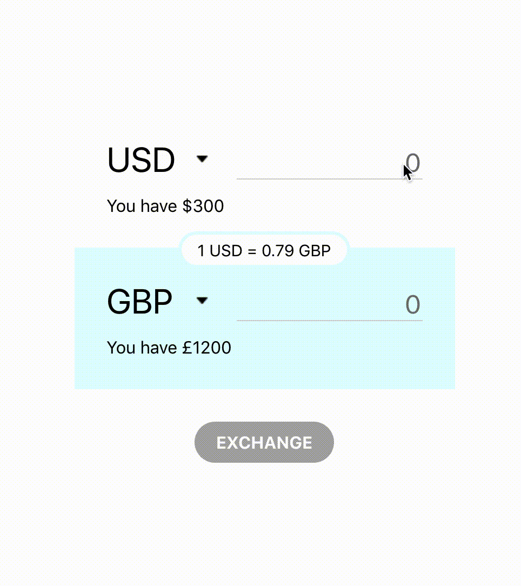

## Exchange app
this project was bootstrapped with ```create-react-app ```

Middleware: react-thunk <br>
Store: redux <br>
HTTP client: axios



## Available Scripts

In the project directory, you can run:

`npm start`

Runs the app in the development mode.<br>
Open [http://localhost:3000](http://localhost:3000) to view it in the browser.

The page will reload if you make edits.<br>
You will also see any lint errors in the console.

`npm test`

Launches the test runner in the interactive watch mode.<br>

###next steps:
- refactor App.js --> avoid setTimeout, make setComponentState more readable 
- implement unit tests with Jest
- refactor css --> add sass
- implement Flow as type checking
